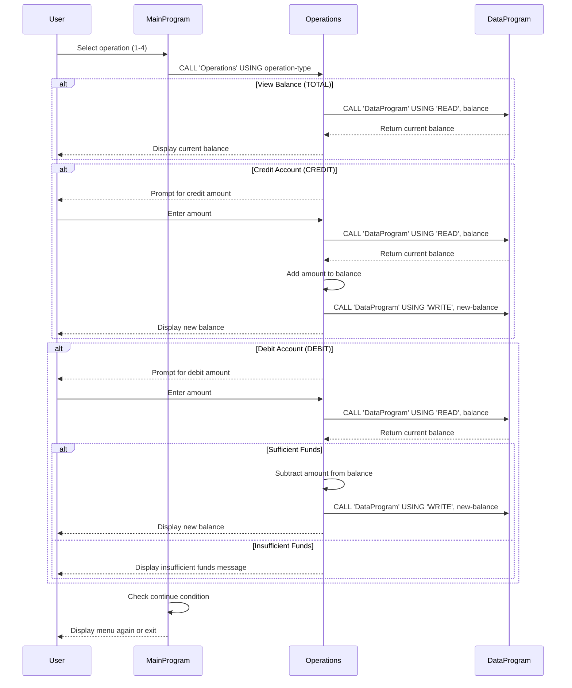

# COBOL Student Account Management System

This project contains a legacy COBOL-based system for managing student accounts. The system allows viewing account balances, crediting accounts, and debiting accounts with basic validation.

## COBOL Files Overview

### data.cob
**Purpose**: Handles persistent data storage for account balances.

**Key Functions**:
- Stores the current account balance in working storage (initially set to 1000.00)
- Provides read/write operations for balance data
- Acts as a simple data layer for balance management

**Parameters**:
- `PASSED-OPERATION`: Operation type ('READ' or 'WRITE')
- `BALANCE`: Balance value for read/write operations

### main.cob
**Purpose**: Main entry point and user interface for the account management system.

**Key Functions**:
- Displays a menu-driven interface for account operations
- Handles user input and choice validation
- Calls the operations program based on user selections
- Manages program flow and exit conditions

**Menu Options**:
1. View Balance
2. Credit Account
3. Debit Account
4. Exit

### operations.cob
**Purpose**: Implements the core business logic for account operations.

**Key Functions**:
- View current account balance
- Credit (add funds) to account
- Debit (subtract funds) from account with validation
- Integrates with data storage layer for balance persistence

**Operations**:
- `TOTAL`: Displays current balance
- `CREDIT`: Adds specified amount to balance
- `DEBIT`: Subtracts specified amount from balance (if sufficient funds)

## Business Rules for Student Accounts

1. **Initial Balance**: All student accounts start with a balance of $1000.00
2. **Credit Operations**: Students can add any positive amount to their account balance
3. **Debit Operations**: Students can only debit amounts that do not exceed their current balance
4. **Insufficient Funds**: Debit operations are rejected if the requested amount exceeds the available balance
5. **Balance Persistence**: Account balances are maintained across program sessions through the data storage layer

## System Architecture

The system follows a modular design with three main components:
- **Main Program**: User interface and program control
- **Operations Module**: Business logic and validation
- **Data Module**: Data persistence and storage

This separation allows for maintainable code and clear separation of concerns in the legacy COBOL system.

## System Data Flow

